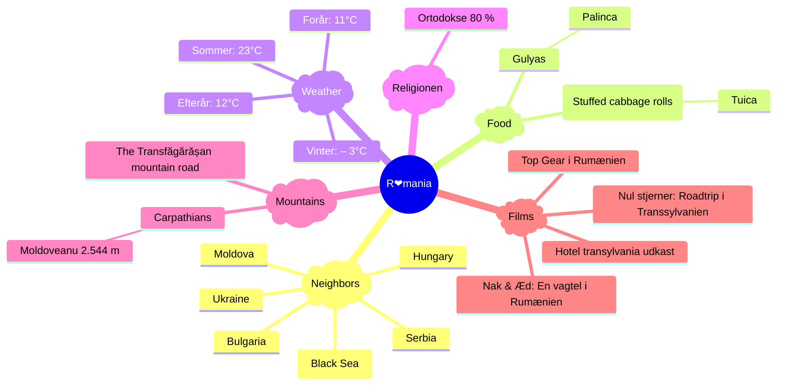

## Introduction into Romania

```mermaid
mindmap
  root((R❤mania))
    Neighbor )Neighbors(
        Hungary
        Serbia
        Bulgaria
        Black[Black Sea]
        Ukraine
        Moldova 
    Mad )Food(
        Gulyas
            Palinca
        Sarmale (Stuffed cabbage rolls)
            Tuica  
    Vejret )Weather(
        Vinter: – 3°C	
        Forår: 11°C	
        Sommer: 23°C	
        Efterår: 12°C
    Religionen )Religionen(
        Ortodokse 80 %
    Mountains )Mountains(
        Carpathians 
            Moldoveanu 2.544 m
        The Transfăgărășan mountain road
    Films )Films(
        Hotel transylvania udkast
        Top Gear i Rumænien
        Nul stjerner: Roadtrip i Transsylvanien
        Nak & Æd: En vagtel i Rumænien
```